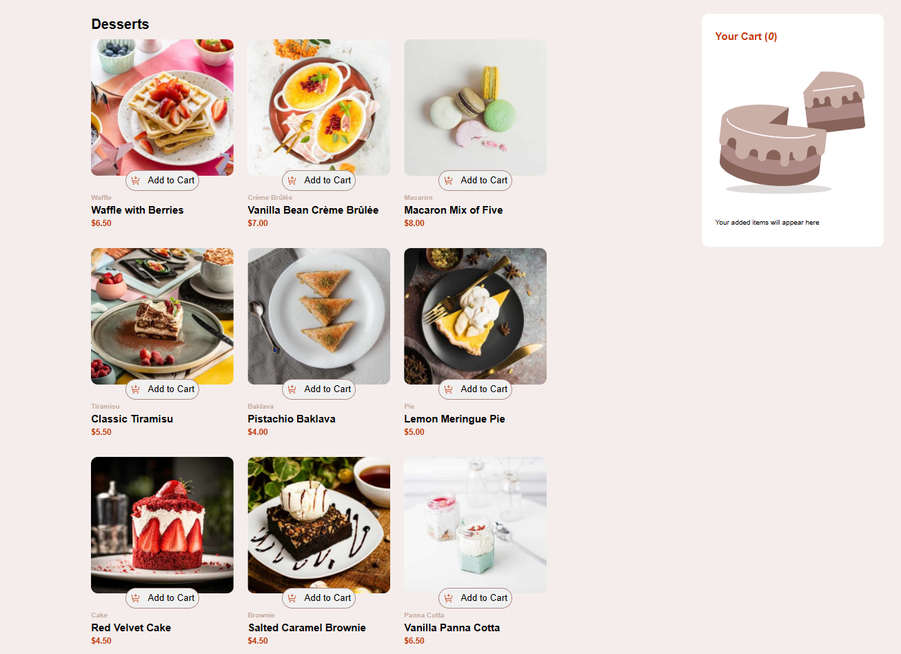
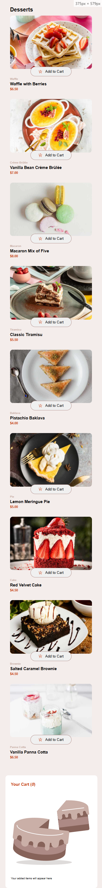

# Frontend Mentor - Product List with Cart Solution

This is my solution to the [Product list with cart challenge on Frontend Mentor](https://www.frontendmentor.io/challenges/product-list-with-cart-5MmqLVAp_d). The challenge helped me improve my DOM manipulation skills and learn how to create interactive modals and button interactions using JavaScript.

## Table of Contents

- [Overview](#overview)
  - [The Challenge](#the-challenge)
  - [Screenshot](#screenshot)
  - [Links](#links)
- [My Process](#my-process)
  - [Built With](#built-with)
  - [What I Learned](#what-i-learned)
  - [Continued Development](#continued-development)

## Overview

### The Challenge

Users should be able to:

- Add items to the cart and remove them
- Increase or decrease the quantity of items in the cart
- See an order confirmation modal when clicking "Confirm Order"
- Reset their selections with "Start New Order"
- View a responsive layout depending on their device's screen size
- See hover and focus states for all interactive elements

### Screenshot

**Desktop design**

**Mobile design**

### Links

- Solution URL: (https://github.com/GregorioVeraza/Product-list-with-cart)
- Live Site URL: (https://gregorioveraza.github.io/Product-list-with-cart)

## My Process

### Built With

- Semantic HTML5
- CSS
- Flex
- CSS Grid
- Vanilla JavaScript

### What I Learned

During this project, I learned a lot about:

- Manipulating the DOM with JavaScript to update content dynamically
- Creating and controlling modals for order confirmation
- Handling button interactions for adding, removing, and updating cart items
- Managing state in JavaScript for the cart and products
- Implementing responsive layouts using CSS Grid and Flexbox

### Continued Development

In future projects, I want to:

- Further modularize my JavaScript code for better maintainability
- Explore more advanced state management techniques
- Improve responsive design adding a tablet version
- Explore technologies like React